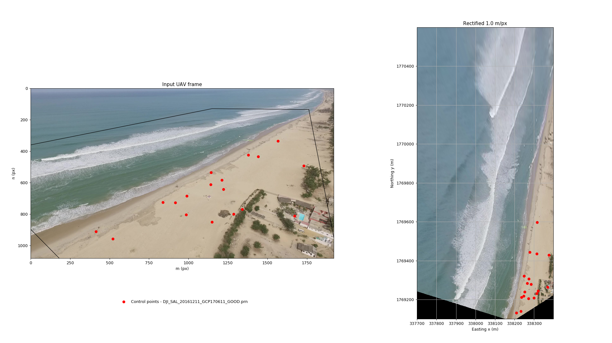

# stlouis
Scripts for preprocessing (rectification) of Saint Louis UAV videos.

## Requirements
- Scientific Python distribution including numpy, scipy, matplotlib, scikit-image. E.g. [Anaconda](https://www.continuum.io/downloads), [Canopy](https://www.enthought.com/products/canopy/);
- FFMPEG for frames extraction;

## Usage
Run `python preprocessor.py`.

